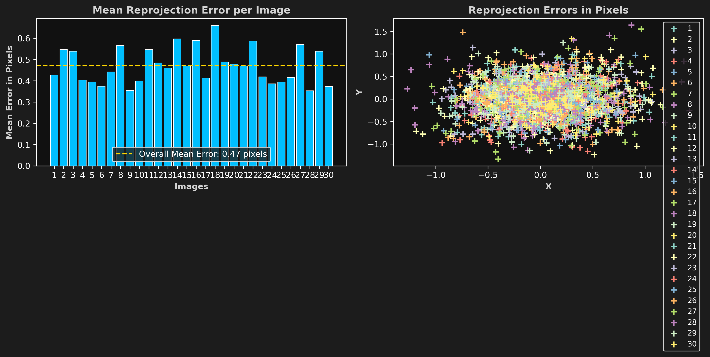

# 📷 Zhang Camera Calibration

> **Hiệu chỉnh camera RGB sử dụng phương pháp Zhang (Checkerboard) với OpenCV — có trực quan hóa đầy đủ**

---

## 📖 Mục lục

- [Giới thiệu](#-giới-thiệu)
- [Lý thuyết](#-lý-thuyết)
- [Tính năng](#-tính-năng)
- [Cấu trúc thư mục](#-cấu-trúc-thư-mục)
- [Yêu cầu](#-yêu-cầu)
- [Cài đặt](#-cài-đặt)
- [Hướng dẫn sử dụng](#-hướng-dẫn-sử-dụng)
- [Cấu hình tham số](#-cấu-hình-tham-số)
- [Đầu ra](#-đầu-ra)
- [Kết quả mẫu](#-kết-quả-mẫu)
- [Giải thích mã nguồn](#-giải-thích-mã-nguồn)

---

## 🎯 Giới thiệu

**Zhang Calibration** là công cụ hiệu chỉnh camera (camera calibration) được xây dựng bằng Python và OpenCV, dựa trên phương pháp của **Zhengyou Zhang (2000)**. Công cụ này giúp xác định các **thông số nội tại (intrinsic parameters)** và **hệ số méo (distortion coefficients)** của camera từ nhiều ảnh chụp bảng cờ vua (checkerboard) ở các góc độ khác nhau.

Ứng dụng điển hình:

- 🤖 **Robot Vision** — Hiệu chỉnh camera trước khi sử dụng trong hệ thống robot
- 🚗 **Autonomous Driving** — Chuẩn hóa camera trên xe tự lái
- 📐 **3D Reconstruction** — Khôi phục không gian 3D chính xác từ ảnh 2D
- 🔬 **Scientific Imaging** — Loại bỏ méo thấu kính trong đo lường khoa học

---

## 📐 Lý thuyết

### Ma trận nội tại (Camera Matrix K)

$$K = \begin{bmatrix} f_x & 0 & c_x \\ 0 & f_y & c_y \\ 0 & 0 & 1 \end{bmatrix}$$

| Tham số | Ý nghĩa |
|---------|---------|
| `fx`, `fy` | Tiêu cự theo trục X, Y (đơn vị pixel) |
| `cx`, `cy` | Tọa độ điểm chính (principal point), thường gần tâm ảnh |

### Hệ số méo (Distortion Coefficients)

$$D = [k_1, \; k_2, \; p_1, \; p_2, \; k_3]$$

- `k1, k2, k3`: Hệ số méo hướng tâm (radial distortion)
- `p1, p2`: Hệ số méo tiếp tuyến (tangential distortion)

### Sai số chiếu lại (Reprojection Error)

$$E_{reproj} = \left\| \mathbf{p}_{pixel} - \text{Project}(\mathbf{P}_{world},\, K,\, D,\, R,\, T) \right\|_2$$

Sai số chiếu lại thấp (< 1 pixel) là chỉ số cho thấy kết quả calibration tốt.

---

## ✨ Tính năng

### Phát hiện góc bàn cờ
- Sử dụng `cv2.findChessboardCornersSB` với flag `CALIB_CB_EXHAUSTIVE | CALIB_CB_ACCURACY` cho độ chính xác cao nhất
- Tinh chỉnh vị trí đến độ chính xác **sub-pixel** bằng `cornerSubPix`
- Tự động thay đổi kích thước ảnh nếu các ảnh có kích thước không đồng nhất

### Quy trình hiệu chỉnh nhiều bước
- **Bước 1** — Phát hiện checkerboard trên tất cả ảnh
- **Bước 2** — Calibration sơ bộ (Initial Calibration)
- **Bước 3** — Loại bỏ ảnh ngoại lệ (Outlier Rejection) với ngưỡng reprojection error có thể cấu hình
- **Bước 4** — Calibration chính xác lần cuối (Final Calibration) trên tập ảnh đã lọc

### Trực quan hóa toàn diện
| Biểu đồ | Mô tả |
|---------|-------|
| `reprojection_error.png` | Bar chart (sai số trung bình mỗi ảnh) + Scatter plot (phân tán sai số X/Y) |
| `reprojection_traceback.png` | Trace-back vector mũi tên lên ảnh (Top 6 ảnh có lỗi cao nhất) |
| `chessboard_error_heatmap.png` | Heatmap sai số theo từng góc trên bàn cờ |
| `reprojection_traceback_individual/` | Ảnh trace-back riêng lẻ chất lượng cao cho từng ảnh calibration |
| `RGB_camera_calib_img_corners/` | Ảnh có vẽ corners + trục tọa độ 3D (X đỏ, Y xanh lá, Z xanh lam) |

### Undistort ảnh thường
- Áp dụng ma trận K và hệ số D đã tính để undistort ảnh bất kỳ
- Tự động cắt viền đen sau khi undistort

---

## 📁 Cấu trúc thư mục

```
zhang_calibration/
│
├── calibrate.py              # Script chính — điểm khởi chạy
├── calibrate_helper.py       # Module Calibrator — toàn bộ logic
├── requirements.txt          # Thư viện Python cần thiết
├── output.txt                # Ví dụ đầu ra khi chạy thực tế
├── reprojection_error.png    # Biểu đồ sai số (được tạo sau khi chạy)
│
└── pic/                      # Thư mục ảnh (tạo tự động khi chạy)
    ├── RGB_camera_calib_img/              # ← ĐẶT ẢNH CALIBRATION VÀO ĐÂY
    ├── RGB_camera_normal_img/             # ← ĐẶT ẢNH CẦN UNDISTORT VÀO ĐÂY (tùy chọn)
    ├── RGB_camera_calib_img_corners/      # [Đầu ra] Ảnh vẽ corners + trục 3D
    ├── RGB_camera_normal_img_undistorted/ # [Đầu ra] Ảnh đã undistort
    ├── reprojection_error.png             # [Đầu ra] Biểu đồ sai số tổng hợp
    ├── reprojection_traceback.png         # [Đầu ra] Trace-back vector lỗi
    ├── chessboard_error_heatmap.png       # [Đầu ra] Heatmap lỗi theo vị trí góc
    └── reprojection_traceback_individual/ # [Đầu ra] Ảnh trace-back đơn lẻ
```

---

## 🔧 Yêu cầu

| Thư viện | Phiên bản tối thiểu |
|----------|---------------------|
| Python   | 3.8+                |
| OpenCV   | 4.5+                |
| NumPy    | bất kỳ              |
| Matplotlib | (cài tự động cùng NumPy) |

---

## 🚀 Cài đặt

### 1. Clone repository

```bash
git clone https://github.com/NamKhanh2128/zhang_calibration.git
cd zhang_calibration
```

### 2. Tạo môi trường ảo (khuyến nghị)

```bash
# Windows
python -m venv .venv
.venv\Scripts\activate

# Linux / macOS
python3 -m venv .venv
source .venv/bin/activate
```

### 3. Cài đặt thư viện

```bash
pip install -r requirements.txt
```

---

## 📸 Hướng dẫn sử dụng

### Bước 1 — Chuẩn bị ảnh calibration

Chụp **ít nhất 10–15 ảnh** bảng cờ vua (checkerboard) ở các góc độ và khoảng cách khác nhau.

> **Lưu ý quan trọng khi chụp ảnh:**
> - Bảng cờ phải **phủ đều** các vùng của ảnh (góc, cạnh, trung tâm)
> - Tránh **blur** — ảnh phải rõ nét để detect corners chính xác
> - Chụp ở **ít nhất 3 góc nghiêng** khác nhau (≥ 15°–30°)
> - Định dạng hỗ trợ: `.jpg`, `.jpeg`, `.png`, `.bmp`

Đặt tất cả ảnh calibration vào thư mục:
```
pic/RGB_camera_calib_img/
```

*(Thư mục sẽ được tạo tự động khi chạy lần đầu)*

### Bước 2 — Cấu hình tham số bàn cờ trong `calibrate.py`

Mở file `calibrate.py` và chỉnh sửa hai thông số quan trọng:

```python
# Số góc NỘI TẠI của bàn cờ (inner corners)
# = (số ô theo chiều ngang - 1, số ô theo chiều dọc - 1)
shape_inner = (11, 8)   # Ví dụ: bàn cờ 12x9 ô → inner corners = (11, 8)

# Kích thước một ô vuông (đơn vị: mét)
square_size = 0.017     # Ví dụ: ô vuông 17mm = 0.017 m
```

> **Cách đếm inner corners:** Đếm số góc giao nhau **bên trong** bàn cờ, KHÔNG tính viền ngoài.

### Bước 3 — Chạy chương trình

```bash
python calibrate.py
```

### Bước 4 (Tùy chọn) — Undistort ảnh thường

Đặt ảnh cần undistort vào:
```
pic/RGB_camera_normal_img/
```

Kết quả sẽ được lưu vào `pic/RGB_camera_normal_img_undistorted/`.

---

## ⚙️ Cấu hình tham số

### Trong `calibrate.py`

| Tham số | Mặc định | Mô tả |
|---------|----------|-------|
| `shape_inner` | `(11, 8)` | Số inner corners theo (W, H) |
| `square_size` | `0.017` | Kích thước ô vuông (mét) |
| `visualization` | `False` | Hiển thị cửa sổ ảnh khi chạy |

### Trong class `Calibrator` (calibrate_helper.py)

| Tham số | Mặc định | Mô tả |
|---------|----------|-------|
| `auto_resize` | `True` | Tự động resize ảnh không đồng kích thước |
| `outlier_threshold` | `3.0` | Ngưỡng loại ảnh (mean reprojection error > ngưỡng này sẽ bị loại) |
| `alpha` (undistort) | `0` | `0` = cắt viền đen hoàn toàn, `1` = giữ toàn bộ pixels |

---

## 📊 Đầu ra

### In ra terminal

```
========================================================================
  STEP 1: DETECT CHECKERBOARD
========================================================================
Images : 25
Pattern: 11 x 8
Grid   : 17.0 mm
[OK] img_001.jpg                       88 corners 820.5 ms
[OK] img_002.jpg                       88 corners 825.1 ms
...

========================================================================
  STEP 4: FINAL CALIBRATION
========================================================================

Camera Matrix K:
[[1825.5    0.0  964.0]
 [   0.0 1818.1 1280.2]
 [   0.0    0.0    1.0]]

Distortion:
[ 2.30e-01 -1.01e+00  3.52e-05 -6.97e-04  1.17e+00]

Final RMS: 0.6982 px

Intrinsic:
fx=1825.497
fy=1818.066
cx=963.991
cy=1280.191
```

### File ảnh được tạo

```
pic/
├── reprojection_error.png          # Biểu đồ bar + scatter sai số
├── reprojection_traceback.png      # Trace-back vector trên top 6 ảnh
├── chessboard_error_heatmap.png    # Heatmap lỗi theo từng góc bàn cờ
├── reprojection_traceback_individual/
│   ├── img_001_traceback.png
│   ├── img_002_traceback.png
│   └── ...
└── RGB_camera_calib_img_corners/
    ├── img_001.jpg                 # Ảnh có vẽ corners + trục X/Y/Z
    └── ...
```

---

## 📈 Kết quả mẫu

### Thông số máy ảnh thực tế (25 ảnh, pattern 11×8, ô 17mm)

| Tham số | Giá trị |
|---------|---------|
| `fx` | 1825.497 px |
| `fy` | 1818.066 px |
| `cx` | 963.991 px |
| `cy` | 1280.191 px |
| `k1` | 0.2305 |
| `k2` | -1.0127 |
| `p1` | 3.52e-05 |
| `p2` | -6.97e-04 |
| `k3` | 1.1727 |
| **Final RMS** | **0.6982 px** ✅ |

### Phân phối sai số (2200 điểm)

| Khoảng | Số điểm |
|--------|---------|
| < 0.1 px | 63 |
| 0.1 – 0.2 px | 166 |
| 0.2 – 0.5 px | 784 |
| 0.5 – 1.0 px | 910 |
| 1.0 – 2.0 px | 268 |
| 2.0 – 5.0 px | 9 |
| > 5.0 px | 0 |

> **Nhận xét:** RMS ≈ 0.70 px là kết quả tốt cho camera smartphone độ phân giải cao. Hơn 91% điểm có sai số dưới 1 pixel.

### Biểu đồ sai số chiếu lại



---

## 🧩 Giải thích mã nguồn

### `calibrate.py` — Script chính

Tệp điểm vào, định nghĩa cấu hình và chạy quy trình theo thứ tự:

```
Cấu hình đường dẫn
    → Tạo thư mục
    → Khởi tạo Calibrator
    → calibrate_camera()
    → undistort_images() (nếu có ảnh)
```

### `calibrate_helper.py` — Module `Calibrator`

| Phương thức | Mô tả |
|-------------|-------|
| `__init__()` | Khởi tạo, tính object points 3D, load đường dẫn ảnh |
| `detect_corners()` | Detect + refine corners đến độ chính xác sub-pixel |
| `calibrate_camera()` | Toàn bộ pipeline: detect → initial calib → outlier rejection → final calib → visualize |
| `visualize_reprojection_on_image()` | Vẽ vector mũi tên trace-back lên ảnh gốc bằng Quiver plot |
| `visualize_board_heatmap()` | Vẽ heatmap sai số theo vị trí góc trên bàn cờ |
| `undistort_images()` | Undistort toàn bộ ảnh trong thư mục bằng K và D đã tính |

### Luồng xử lý `calibrate_camera()`

```
STEP 1: Detect corners trên tất cả ảnh
    ↓
STEP 2: Initial calibration (cv2.calibrateCamera)
    ↓
STEP 3: Tính reprojection error từng ảnh → Loại ảnh có mean error > threshold
    ↓
STEP 4: Final calibration trên tập ảnh đã lọc
    ↓
STEP 5: Tính & in chi tiết reprojection error + vẽ biểu đồ
    ↓
STEP 5b: Trace-back visualization + Heatmap bàn cờ
    ↓
STEP 6: Lưu ảnh corners có vẽ trục tọa độ 3D
```

---

## 📜 Giấy phép

Dự án được phân phối theo giấy phép **MIT License** — xem tệp [LICENSE](LICENSE) để biết thêm chi tiết.

---

## 📚 Tài liệu tham khảo

1. **Z. Zhang** — *"A flexible new technique for camera calibration"*, IEEE TPAMI 2000.  
   [https://doi.org/10.1109/34.888718](https://doi.org/10.1109/34.888718)

2. **OpenCV Camera Calibration Documentation**  
   [https://docs.opencv.org/4.x/dc/dbb/tutorial_py_calibration.html](https://docs.opencv.org/4.x/dc/dbb/tutorial_py_calibration.html)

3. **OpenCV `findChessboardCornersSB`**  
   [https://docs.opencv.org/4.x/d9/d0c/group__calib3d.html](https://docs.opencv.org/4.x/d9/d0c/group__calib3d.html)
